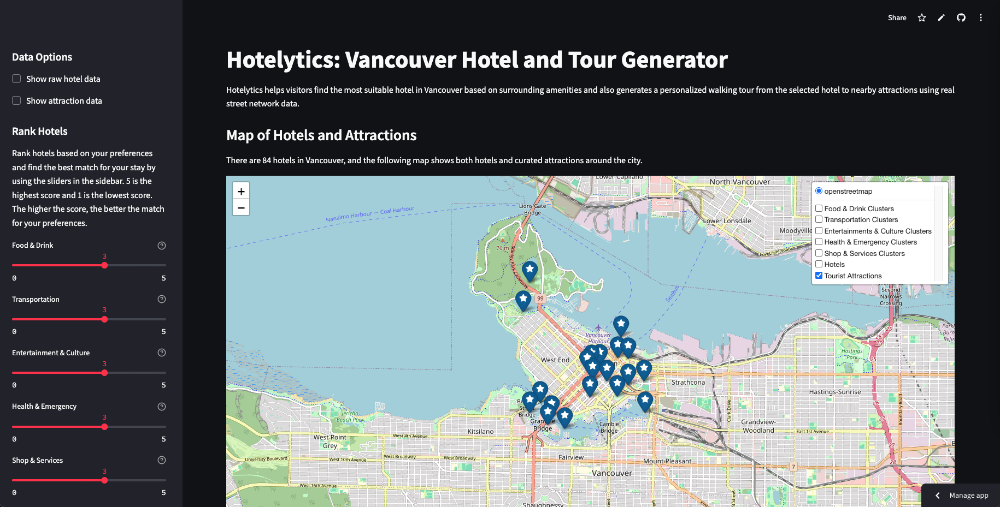

# Hotelytics: Vancouver Hotel and Tour Generator

## Overview

This project uses OpenStreetMap (OSM) data to help users find the most suitable hotel in Vancouver based on (given dataset of) surrounding amenities and walkability. It also generates a personalized walking tour from the selected hotel to nearby attractions using real street network data.



## Project Objectives

- Recommend hotels based on proximity to key amenities (e.g., food, transportation, culture).
- Allow users to assign weights to different amenity categories.
- Identify high-density zones of activity (hotspots) using (DBSCAN) clustering.
- Compare and contrast walking tours generated by two methods: Traveling Salesman Problem (TSP) and Nearest Neighbour Greedy.

## Data Sources

- **Hotels Dataset**: Extracted from OpenStreetMap (GeoJSON format), cleaned and standardized.
- **OSM Amenities**: `amenities-vancouver.json.gz`, categorized into `food & drink`, `transporation`, `entertainments & culture`, `health & emergency`, `shop & services`.
- **Curated Attractions List**: Custom list of Vancouver landmarks with coordinates and basic descriptions.

## Key Features

### 1. Hotel Scoring System

- Apply a 350-meter buffer around each hotel.
- Count the number of nearby amenities per category.
- Weight counts based on user preferences (e.g., food = 2, culture = 3).
- Calculate the total score for each hotel and normalise the score to 0-100 scale.
  

### 2. Amenity Clustering System

- Given all categories of amenity (excluding `others`), convert coordinates to projected CRS (EPSG:26910) for accurate distance calculations.
- Apply DBSCAN clustering algorithm per category and tune `eps` (distance radius) and `min_samples` based on each category’s density.
- Remove noise points (cluster label = -1).
- Draw convex hulls around each cluster to visualize dense amenity zones.
- Display clusters on the map with distinct colors by category.
  

### 3. Walking Tour Generator

- Attractions are custom-curated and manually added by the group.
- Identify the closest attractions to a selected hotel using Haversine distance.
- Compute realistic walking routes using OpenStreetMap pedestrian data with `osmnx`.
- Optimize the route order using two algorithms:
  - **Traveling Salesman Problem (TSP)**: Computes the most efficient full tour using `networkx`.
    
  - **Nearest Neighbour (Greedy)**: Quickly builds a short tour by always visiting the closest next stop.
    

## Technologies and Tools

- **Data Processing**: `numpy`, `pandas`, `geopandas`, `shapely`
- **Spatial Analysis & Routing**: `osmnx`, `networkx`
- **Clustering**: `scikit-learn` (DBSCAN)
- **Visualization**: `folium`
- **Web Interface**: `streamlit`, `streamlit-folium`

## How to Run

1. **Install Required Packages**: Make sure you have Python 3.8+ installed. Then install the required libraries by running the following commands:
    ```bash
    pip install numpy pandas geopandas shapely osmnx networkx scikit-learn folium streamlit streamlit-folium
    ```

2. **Run with this command line**: Navigate to the project directory in your terminal and run:
    ```bash
    streamlit run app.py
    ```

## Authors

This project was developed as part of a data science course at Simon Fraser University.  
Contributors: [Vu Hai Nam Nguyen](mailto:vhn1@sfu.ca?subject=Hotelytics:%20General%20Inquiry) and [The Vi Phung](mailto:tvp@sfu.ca?subject=Hotelytics:%20General%20Inquiry)
